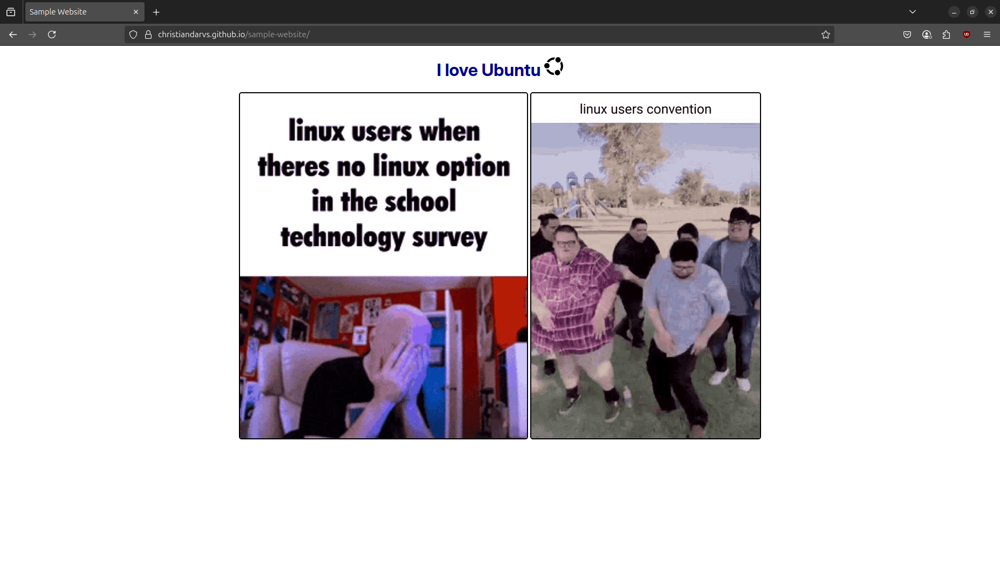

# Sample Website

A website containing linux memes. The objective is to familiarize myself with different git commands.

## Live Website

[https://christiandarvs.github.io/sample-website/](https://christiandarvs.github.io/sample-website/)



## Git commands used

```git
git init
git commit -m "description"
git push
git pull
git checkout <branch>
git clone
```
